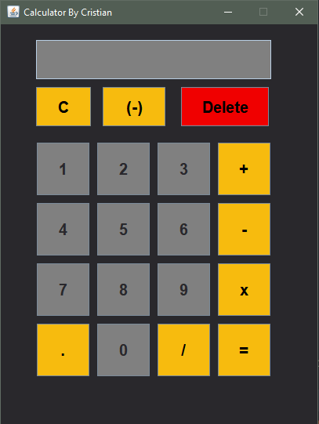
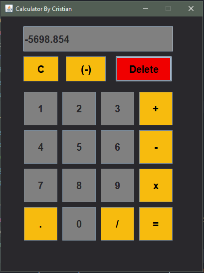

# :star: Basic-Calculator-Java :star:
                 

## Description 📓
This repository contains a simple calculator implemented in Java using the Swing library to create the graphical user interface (GUI). The calculator allows to perform basic arithmetic operations, such as addition, subtraction, multiplication and division, providing an intuitive and user-friendly experience.


## Key Features 🔑
* Attractive graphical interface: The calculator has a graphical user interface designed with Java Swing, which allows for easy and visually pleasing interaction.

* Basic functionality: The program allows performing addition, subtraction, multiplication and division operations between two numbers. The results are displayed in real time on the calculator screen.

* Intuitive buttons: The buttons on the interface have clear and representative labels for each operation, making it easy to use for users of all levels.

* Safe operations: The calculator performs checks to ensure that operations are safe and that there are no divisions by zero.

https://github.com/CristianLopez3/Basic-Calculator-Java.git

## How to use the calculator 📑
1. Clone the repository on your local machine using the command:
```
https://github.com/CristianLopez3/Basic-Calculator-Java.git
```
2. Open the project in your preferred Java IDE (e.g. Eclipse or IntelliJ).

3. Compile and run the application.

4. The calculator window will appear on your screen. Use the mouse or keyboard to interact with the buttons and perform the operations.

## Contributions 🌞
Contributions are welcome! If you have any ideas for improving the calculator or adding new features, feel free to fork the repository and submit your proposals via pull requests.

### Notes ✏️
This basic calculator is an educational project and there may be areas for improvement or expansion. Feel free to customize it or use it as a base for more complex projects.

Disclaimer: This calculator is designed for educational purposes and is not guaranteed for use in production environments.

I hope you find this calculator useful and enjoy exploring the code! If you have any questions or suggestions, feel free to contact us.

Happy calculating!


